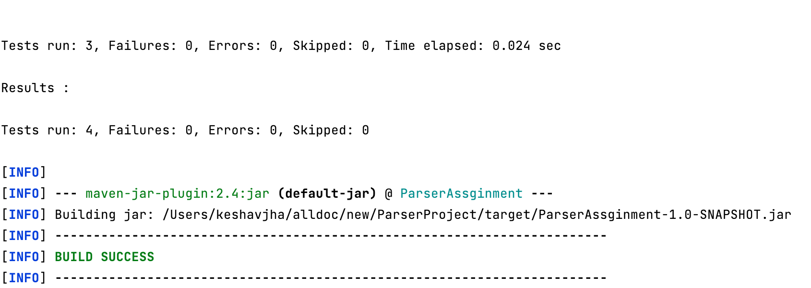
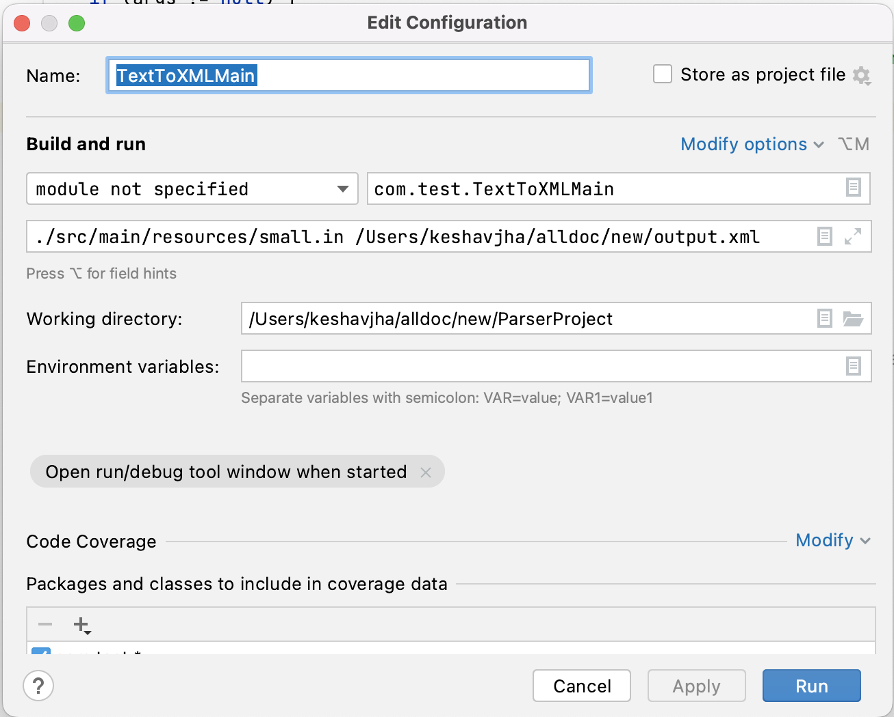

# String to Xml Parsing
Java program that can convert text into either XML formatted data or comma separated (CSV) data. The text is to be parsed, broken into sentences and words and the words have to be sorted.
## Local Build
How to create uber jar which creates execution jar with all the dependencies.
```
mvn clean compile assembly:single
```

## Unit Test Execution
```
mvn clean package
```


## Execution
To execute locally, use the command in the following format

java -jar ./target/ParserAssginment-1.0-SNAPSHOT-jar-with-dependencies.jar <INPUT_FILE> <OUTPUT_FILE> <FORMAT>

INPUT_FILE - Input File contains text as strings.

OUTPUT_FILe - Generated Output file based on the user input for the format.

FORMAT - XML|xml or CSV|csv as the value for this argument, for XML output format will be .xml and for CSV it would be .csv.

```
java -jar ./target/ParserAssginment-1.0-SNAPSHOT-jar-with-dependencies.jar ./src/main/resources/small.in /Users/keshavjha/Downloads/output.xml
```

or use run.sh for build and execution

```
./run.sh
```

If require user needs to set the permission for execution run.sh using 
```
chmod 777 ./run.sh
```


## Execution Configuration for TextToXML.java



